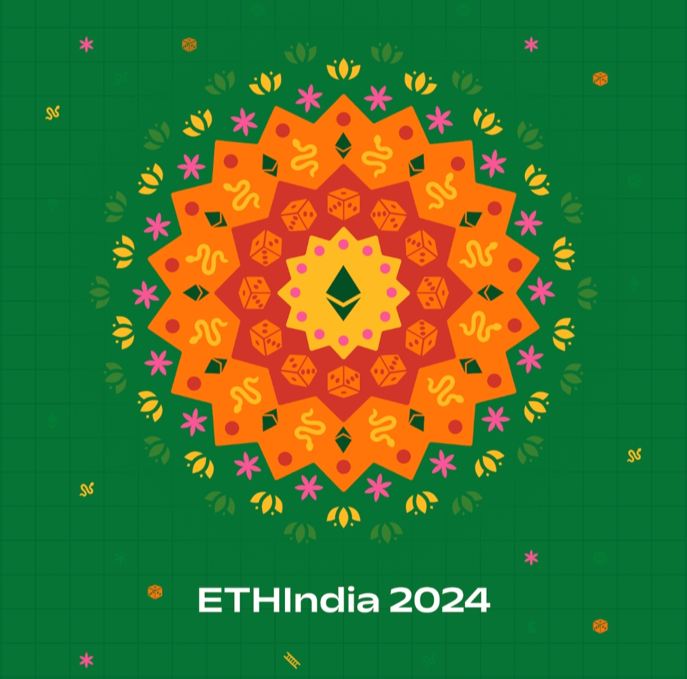

<!--
 
  

 -->
<h2>Hello folks! I'm Manu</h2>

<!--  -->

## 🪡 My Skills

<!--- **Blockchain Technologies:** Ethereum, -->

<!--## 🔭 I’m currently working on
- Contributing to blockchain projects -->

##  🌐  I’m currently learning 🚀

- **Blockchain Technologies**: Exploring the fundamentals of blockchain, consensus algorithms, and cryptographic principles.[![Blockchain]
- **Smart Contracts**: Developing and deploying smart contracts on Ethereum using Solidity.
- **DApp Development**: Building decentralized applications with frameworks like Web3.js and Ethers.js.
- **NFTs (Non-Fungible Tokens)**: Learning about the creation, management, and trading of NFTs on various platforms.
---

<!-- ## 👯 I’m looking to collaborate on
- Blockchain-based projects
- Open-source initiatives -->

<!-- ## 🤔 I’m looking for help with
- Understanding zero-knowledge proofs
- Optimizing smart contract gas usage -->

<!--## 💬 Ask me about
- Blockchain technology
- Web3 development-->

## 📫 How to reach me

 
  

<h3>🏆 POAP Achievements</h3>

  
  
<strong>ETHIndia24 POAP</strong> 
  Participated in one of the largest Ethereum developer hackathons.

